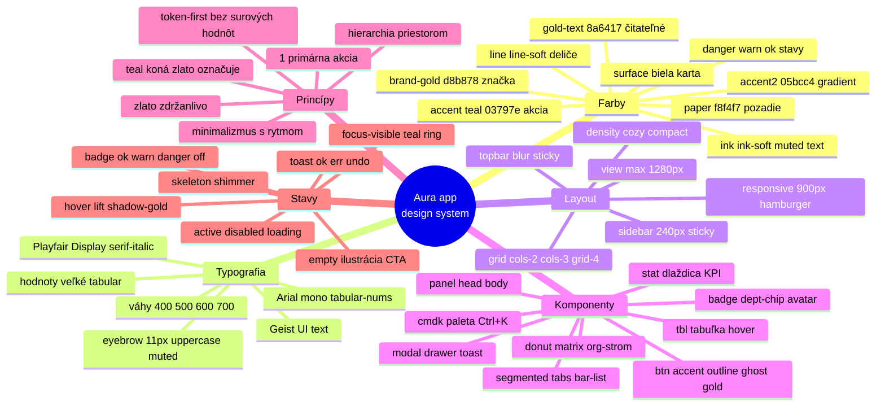

# Aura app dizajnový systém

> Referenčný návod, ako postaviť ďalšiu Aura aplikáciu (alebo rozšírenie), aby vyzerala a fungovala konzistentne — svetlá, prémiová, minimalistická biznis estetika značky Aura (šperky).

## Prehľad

Aura appky sú interné aj zákaznícke nástroje značky Aura. Vizuálny jazyk je odvodený od šperkárskej identity: **svetlé krémovo-ružové pozadie, teal akcent, zlato ako rezervovaný luxusný signál, seriózna typografia**. Cieľom je pôsobiť prémiovo a pokojne — nie „SaaS pestrofarebne". Menej farby, viac priestoru, jeden jasný akcent na obrazovku.

Referenčná implementácia je appka **Aura · HR mapa** (`styles.css`, čisté browser JS v IIFE, žiadne kniždice/build). Táto appka je zdroj pravdy pre tokeny, komponenty a vzory. Nová Aura appka **kopíruje `styles.css` a `app.js` UI kit** a stavia na nich — nezavádza nový vizuálny jazyk.

Kľúčové vlastnosti systému:

- **Token-first.** Všetko sú CSS custom properties na `:root` + `[data-theme="dark"]`. Komponenty nikdy nepoužívajú surové hodnoty.
- **Light aj dark** cez `data-theme` na `<html>`, plus `data-density` (`cozy` / `compact`).
- **Zero-dependency UI kit.** Helpery (`icon`, `badge`, `avatar`, `donut`, `toast`, `openModal`) žijú v `window.APP`; pohľady sa registrujú do `window.VIEWS.<id>`.
- **Zlato je koreňová brand-farba, nie akcent akcií.** Akcie sú teal.

## Kľúčové pojmy

- **Paper** (`--paper #f8f4f7`) — krémovo-ružové pozadie celej appky. Nie biela, nie šedá.
- **Surface / surface-2** — biele plochy kariet (`#ffffff`) a jemne tónované vnorené plochy (`#fbf7f9`).
- **Ink / ink-soft / muted** — trojstupňová textová hierarchia (tmavá zeleno-čierna → tlmená).
- **Accent (teal `#03797e`)** — hlavná akčná farba: CTA, odkazy, aktívne stavy, focus ring. Sekundárny `--accent2 #05bcc4`.
- **Gold / brand-gold (`--gold #b88a3a`, `--brand-gold #d8b878`)** — rezervovaná luxusná farba: koruna (logo), aktívna položka nav, hover-lift kariet, akcenty. **Nie** na bežné tlačidlá.
- **Crown** — zlatá koruna ako brand mark, renderovaná cez CSS `mask` z `aura-crown.png` (`.crown`, `.hero-crown`).
- **Serif-italic** — Playfair Display italic v zlatej pre ozdobný text v nadpisoch (napr. „HR mapa").
- **Density** — `data-density="compact"` zmenší paddingy/výšky pre dátovo husté obrazovky.
- **Segmented / tabs / bar-list / donut / matrix** — pomenované stavebné bloky UI kitu.

## Dizajnová filozofia Aura

1. **Svetlá a pokojná.** Základ je `--paper`, plochy biele s jemným `--shadow`. Žiadne ťažké gradienty na obsahu (gradient len na login/hero pozadí, decentne).
2. **Prémiová cez zdržanlivosť.** Luxus signalizuje priestor, jemné tiene, tabular čísla a zlato v malých dávkach — nie sýtosť či veľa farieb.
3. **Teal koná, zlato označuje značku.** Toto je najdôležitejšie pravidlo. Používateľ klikne teal; zlato mu pripomenie, že je v Aure (logo, aktívna sekcia, ocenené karty).
4. **Jedna primárna akcia na obrazovku.** Hierarchiu rieš veľkosťou, váhou a priestorom; farbu šetri na akcent.
5. **Minimalizmus, nie prázdnota.** Husté dáta sú OK (tabuľky, matice), ale s rytmom: konzistentné medzery, tlmené hlavičky stĺpcov, hover feedback.
6. **Light aj dark rovnocenne.** Dark nie je inverzia — je to samostatná mapa tokenov s tmavými neutrálmi (nie čistá čierna).

## Architektúra (ako to funguje)

**Vrstvenie tokenov.** `styles.css` definuje dve mapy premenných: `:root` (light) a `[data-theme="dark"]`. Inline script v `<head>` prečíta `localStorage` (`aura_theme_mode`, `aura_density`) a nastaví `data-theme` + `data-density` na `<html>` **pred** vykreslením, aby nebliklo. Komponentové triedy (`.btn`, `.panel`, `.stat`…) čítajú len sémantické premenné, takže prepnutie témy nemení ani riadok komponentu.

**Farebné tokeny (light).**

| Token | Hodnota | Použitie |
|---|---|---|
| `--paper` | `#f8f4f7` | pozadie appky |
| `--surface` | `#ffffff` | karty, panely, modaly |
| `--surface-2` | `#fbf7f9` | vnorené plochy, tracky, hlavičky matice |
| `--ink` | `#101d1b` | primárny text |
| `--ink-soft` | `#2d3a38` | sekundárny text |
| `--muted` | `#566964` | popisky, meta, tlmené |
| `--line` / `--line-soft` | `#e6dee3` / `#f0e9ee` | orámovania, deliče |
| `--accent` | `#03797e` | teal akcia/odkaz/focus |
| `--accent2` | `#05bcc4` | sekundárny teal, gradienty |
| `--accent-tint` / `--accent-soft` | `#eef9f9` / `#d6f5f6` | hover pozadia, focus ring |
| `--gold` / `--brand-gold` | `#b88a3a` / `#d8b878` | brand zlato (koruna, aktívny nav) |
| `--gold-text` | `#8a6417` | čitateľné zlato na svetlom |
| `--danger` / `--warn` / `--ok` | `#d64545` / `#d97706` / `#0f8c5a` | stavy |

Rádiusy: `--r-sm 8px`, `--r 10px`, `--r-lg 14px`. Tiene: `--shadow` (jemný), `--shadow-lg` (modaly/drawer), `--shadow-gold` (zlatý hover-lift kariet). Písma: `--font "Geist"`, `--serif "Playfair Display"`, `--mono` (v HR mape zámerne Arial, tabular-nums pre čísla).

**Zlato — kedy áno, kedy nie.**

- ÁNO: logo/koruna, aktívna položka v nav (`inset 3px 0 0 var(--brand-gold)`), hover-lift na kartách/dlaždiciach (`--shadow-gold`, zlaté orámovanie), horný 3px prúžok login karty, role-pill, avatar pozadie, undo tlačidlo v toaste.
- NIE: primárne CTA (to je teal `.btn-accent`), bežné orámovania, text tela, veľké plochy. `.btn-gold` existuje len pre výnimočný luxusný CTA (napr. „Upgrade"), nie ako default.

**Kontrast a hierarchia.** Text vždy z trojice `ink → ink-soft → muted`. Popisky sekcií sú `.eyebrow` / `.k` — 11px, `letter-spacing .1em`, uppercase, `--muted`, bold. Hodnoty veľké a `tabular-nums`. Focus je vždy viditeľný teal ring (`:focus-visible { outline: 2px solid var(--accent) }`).

## Mind mapa dizajnového systému

## Stavebné bloky

**Layout.** `#app` je flex: `.sidebar` (240px, sticky, biela, pravý `--line` okraj) + `.main` (flex column). `.topbar` je sticky s `backdrop-filter: blur(12px)` a poloprieplačným povrchom. Obsah v `.view` (padding 24px, `max-width 1280px`). Pod 900px sa sidebar mení na off-canvas s `.hamburger` a `.overlay`.

**Navigácia.** `.nav-item` = ikona (`.ico`/inline SVG) + label + voliteľný `.count`/`.nav-alert`. Hover = `--accent-tint` + teal text. **Aktívna** = zlaté tónované pozadie + ľavý zlatý prúžok (`inset 3px 0 0 var(--brand-gold)`) + bold. Sekcie oddeľuje `.nav-sep` (uppercase eyebrow).

**Karty a panely.** `.panel` (surface + `--line` + `--r-lg` + `--shadow`) s `.panel-head` (titul + akcie) a `.panel-body`. `.stat` je KPI dlaždica: `.k` popisok, `.v` veľká tabular hodnota, `.sub` meta; hover dvíha a dáva zlatý tieň. Mriežky: `.grid` + `.cols-2` / `.cols-3` / `.grid-4` / `.grid-cards` (auto-fill minmax).

**Formuláre.** `.fld` = blok s `` popiskom (uppercase eyebrow) + input. Inputy: `--surface`, `--line`, `--r-sm`, min-height 34px; focus = teal border + `box-shadow 0 0 0 3px var(--accent-tint)`. `.fld-row` = 2-stĺpcový grid. Tlačidlá: `.btn` základ + varianty `btn-accent` (teal, primárne), `btn-outline`, `btn-ghost`, `btn-gold` (výnimočne), `btn-danger`; veľkosti `btn-sm`/`btn-xs`, `btn-icon`, `btn-block`. Hover na akčných tlačidlách jemne dvíha (`translateY(-1px)`) a pridá farebný tieň.

**Tabuľky.** `table.tbl` v `.tbl-wrap` (`overflow-x:auto`). Hlavičky `th` = uppercase, 10.5px, `--muted`, spodný `--line`. Riadky hover = jemný teal nádych, `cursor:pointer` pre klikateľné. Bunka zamestnanca `.cell-emp` = `.avatar` + meno. Husté varianty cez `data-density="compact"`.

**Badge / chips / avatar.** `.badge` (pill, varianty `ok`/`warn`/`danger`/`off`, `.dot` prefix), `.dept-chip` (farebná bodka `--c` + názov), `.avatar` (zlato tónovaný štvorec so `initials`), `.role-pill` (zlatý). Helper funkcie: `A.badge(text, kind)`, `A.deptChip(name,color)`, `A.avatar(name)`, `A.statusBadge(s)`.

**Overlaye.** `.modal-bd`/`.modal` (centrovaný, `slideIn`, `.wide` variant, `.modal-head`/`-body`/`-foot`, `.close-x`), `.drawer-bd`/`.drawer` (pravý panel 560px), `.cmdk` (command palette, Ctrl+K, teal aktívne položky). Otvárajú sa cez `A.openModal({title, bodyHtml, footHtml, wide, onMount})`.

**Feedback a stavy.** `.toast` (dole vpravo pill, `ok`/`err`, `.undo` so zlatým „Späť"), `.skeleton` (shimmer placeholder), `.empty` (ilustrovaná kružnica `.empty-ill` + `.empty-t` titul + `.empty-d` popis + CTA), `.bulk-bar` (teal lišta hromadného výberu). `@media (prefers-reduced-motion)` vypína animácie.

**Špecializované.** `.hero` (uvítací blok s decentným zlato+teal radial gradientom a korunou), `.segmented` (pill prepínač), `.tabs` (spodný zlatý indikátor), `.bar-list` (horizontálne bary), `.donut` (CSS conic donut, `A.donut(...)`, paleta `DONUT_COLORS` začína zlatou), `.org` / `.org-card` (horizontálny organogram s farebnými panelmi oddelení), `.matrix` (sticky-header/column matica), `.tree-ctrl` (plávajúci zoom).

## Toky / krok za krokom: nová Aura appka

1. **Skopíruj základ.** Prevezmi `styles.css` (celý token + komponentový kit) a `app.js` (UI helpery, router, `icon`/`badge`/`avatar`/`donut`/`toast`/`openModal`). Neprepisuj tokeny — rozširuj.
2. **Nastav `<head>`.** Rovnaký anti-flash inline script (`data-theme` + `data-density` z `localStorage`), `theme-color` meta pre light/dark, Geist + Playfair z Google Fonts, SVG favicon s korunou.
3. **Postav shell.** `#loader` → `.login` (ak treba auth) → `#app` (sidebar + main). Sidebar má korunu + názov + `HR mapa`-štýl podnadpis, `.nav`, `.side-foot` s používateľom a `.role-pill`.
4. **Registruj pohľady.** Každý pohľad = IIFE zapisujúca do `window.VIEWS.<id>`, používa `window.APP` helpery. Renderuj cez template stringy s `esc()`.
5. **Skladaj z existujúcich blokov.** Dashboard = `hero` + `grid grid-4` staty + `cols-2` panely (donut náklady + „na doriadenie"). Zoznam = `.filters` + `.page-actions` + `table.tbl` alebo `.emp-cards`. Detail = `.detail-head` + `.detail-body.has-aside`.
6. **Drž akčnú hierarchiu.** Primárne CTA = `btn-accent` (teal). Sekundárne = `btn-outline`/`btn-ghost`. Zlato len brand/aktívne/hover-lift. Max jedna dominantná akcia na obrazovku.
7. **Doplň stavy.** Pre každý pohľad: loading (`.skeleton` alebo „Načítavam…"), empty (`.empty` s CTA), error (panel s retry + `toast(..., 'err')`), hover/focus. Používaj `A.undo(...)` pre mäkké mazanie.
8. **Over light aj dark aj compact.** Prepni `data-theme` a `data-density`; skontroluj kontrast textu a viditeľnosť focus ringu v oboch.

## Checklist novej Aura appky

- [ ] `styles.css` tokeny prevzaté 1:1 (žiadne surové hex v komponentoch)
- [ ] Pozadie `--paper`, plochy `--surface`, nie biela/šedá appka
- [ ] Anti-flash `<head>` script nastaví `data-theme` + `data-density` pred renderom
- [ ] Geist (UI) + Playfair Display (serif-italic akcenty) + tabular-nums čísla
- [ ] Koruna ako brand mark (CSS mask), SVG favicon s korunou
- [ ] Primárne CTA sú teal `btn-accent`; zlato len brand/aktívne/hover
- [ ] Aktívna nav položka = zlaté pozadie + ľavý zlatý prúžok
- [ ] Sidebar 240px sticky + topbar blur sticky + `.view` max 1280px
- [ ] Karty/staty/tabuľky z UI kitu, hover-lift so `--shadow-gold`
- [ ] Focus-visible teal ring všade; ovládateľné klávesnicou
- [ ] Každý pohľad má loading + empty + error stav
- [ ] Toast + undo pattern pre spätnú väzbu a mazanie
- [ ] Responsive < 900px: hamburger + off-canvas sidebar
- [ ] Light, dark aj compact overené (kontrast + focus)
- [ ] `prefers-reduced-motion` rešpektované

## Časté chyby / gotchas

- **Zlato ako akčná farba.** Zlaté primárne tlačidlá pôsobia gýčovo a rozbijú hierarchiu. Akcia = teal; zlato = značka.
- **Biele/šedé pozadie namiesto `--paper`.** Stráca sa krémovo-ružový Aura pocit; appka vyzerá genericky.
- **Dark mode ako inverzia.** Použi mapu `[data-theme="dark"]` s tmavými neutrálmi (nie `#000`), nie CSS `invert`.
- **Surové hex v komponentoch.** Vždy cez token (`var(--accent)`), inak drift medzi appkami a zlyhá prepnutie témy.
- **Priveľa akcentov naraz.** Viac teal/zlatých CTA na jednej obrazovke = žiadna hierarchia. Jedna primárna akcia.
- **Chýbajúci focus stav.** Bez `:focus-visible` ringu appka nie je prístupná; nespoliehaj sa len na hover.
- **Náhodné medzery a rádiusy.** Drž `--r-sm/-r/-r-lg` a konzistentné paddingy z kitu; nevymýšľaj 13px/17px.
- **Blikanie témy pri načítaní.** Bez anti-flash inline scriptu v `<head>` sa mihne svetlá téma; script musí bežať pred CSS/renderom.
- **Neserifový ozdobný text.** Ozdobný akcent (názov modulu) patrí do `.serif-italic` (Playfair), nie bold Geist.
- **Ignorovaný compact režim.** Dátovo husté obrazovky testuj aj v `data-density="compact"`, inak sú preriedené.

## Súbory a miesta

- `Šperky Aura app/aura-hr-mapa/server/public/styles.css` — kompletný token systém + komponentový UI kit (zdroj pravdy).
- `.../public/index.html` — shell, anti-flash `<head>` script, loader/login/app kostra, Google Fonts, SVG favicon.
- `.../public/app.js` — jadro: `window.APP` helpery (`icon`, `badge`, `avatar`, `deptChip`, `statusBadge`, `money`, `donut`, `toast`, `undo`, `openModal`, `api`, router), konštanty (`DONUT_COLORS`, `BLOCK_COLOR`, mapy typov).
- `.../public/views/*.js` — vzory pohľadov (`dashboard.js` = hero + KPI + donut + „na doriadenie"; `employees.js`, `tree.js`, `positions.js`, `mailboxes.js`, `applications.js`, `settings.js`).
- `.../public/aura-crown.png` — zdroj koruny pre CSS `mask`.
- Súvisiace skills: `skills/design/ui-design-systems.md` (tokeny/OKLCH/Figma teória), `skills/design/brand-graphics.md` (brand vizuál), `skills/it/design-system-component-engineering.md` (komponentová inžinierska vrstva).

## Zdroje

- Referenčná appka Aura · HR mapa (`styles.css`, `app.js`, `views/*.js`) — kanonický vzor.
- `skills/design/ui-design-systems.md` — token architektúra, OKLCH, light/dark, prístupnosť.
- Geist (Vercel) a Playfair Display (Google Fonts) — typografická dvojica Aura.
- WCAG 2.2 — cieľ kontrastu (4.5:1 text, 3:1 UI/veľký text a focus).
