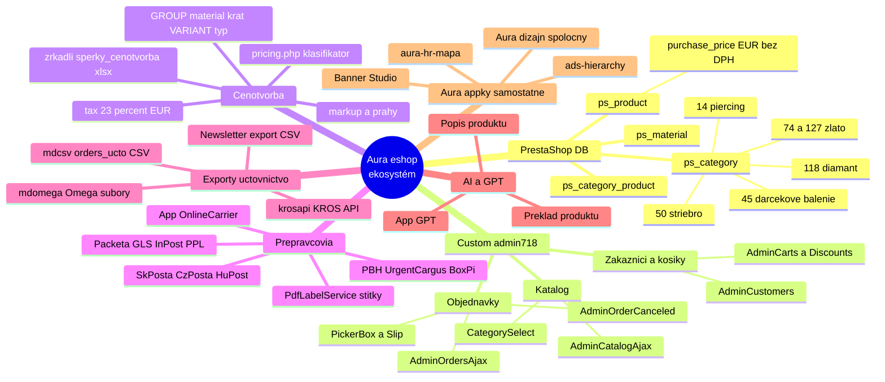
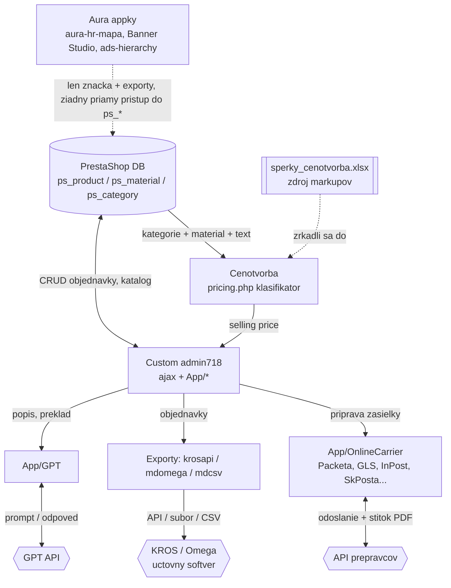

# Eshop ekosystém — mapa

> Prierezová mind mapa celého technologického ekosystému eshopu Aura: ako do seba zapadá PrestaShop databáza, custom admin718, cenotvorba klasifikátor, prepravcovia, účtovné exporty, AI/GPT a samostatné Aura appky.

## Prehľad

Toto nie je detailný playbook o jednej vrstve — je to **letecký pohľad na celý stroj**. Ukazuje, kde ktorý údaj vzniká, kadiaľ tečie a ktorý systém sa oň opiera. Keď niečo padne alebo sa mení cena/kategória/prepravca, tu vidíš, čoho sa to dotkne.

Ekosystém Aury sa skladá z troch svetov, ktoré nie sú jeden monolit:

1. **Jadro eshopu** — PrestaShop (databáza `ps_*`) + nadstavbový **custom admin718**, ktorý riadi objednávky, katalóg, prepravcov a exporty. Toto je transakčné srdce.
2. **Cenotvorba** — samostatný klasifikačný config (`pricing.php`), ktorý z materiálu a typu šperku odvodí markup a predajnú cenu. Sedí medzi katalógom a cenami.
3. **Aura appky** — samostatné interné nástroje (aura-hr-mapa, Banner Studio, ads-hierarchy) v jednotnom Aura dizajne. **Nezdieľajú DB s eshopom**, riešia inú doménu (ľudia, kreatíva, reklamné štruktúry), ale patria pod tú istú značku a estetiku.

Kľúčové pochopenie: **admin718 je integrátor.** Číta a zapisuje do PrestaShop DB, volá cenotvorbu, komunikuje s API prepravcov, generuje účtovné exporty a volá GPT. Aura appky žijú vedľa, prepojené len značkou a (voliteľne) exportmi/CSV, nie priamym prístupom do `ps_*`.

## Kľúčové pojmy

- **PrestaShop DB** — MariaDB schéma eshopu s prefixom `ps_`. Nosné tabuľky pre tento pohľad: `ps_product` (vrátane `purchase_price` — nákupka bez DPH v EUR), `ps_material` (materiálový atribút), `ps_category` + `ps_category_product` (stromové kategórie a zaradenie produktov).
- **Kategória ako signál** — číselné id kategórie nesie sémantiku materiálu/typu. Napr. 74/127 = zlato, 50 = striebro, 118 = diamant, 14 = piercing, 45 = darčekové balenie, 9 = wolfrám, 8 = titán, 2 = oceľ, 44 = bižutéria. Kategórie sa matchujú **na celý podstrom** a vážia 10× viac než textové kľúčové slovo.
- **admin718** — custom PHP administrácia nad PrestaShopom (`ajax/*Ajax.php`, `App/*`, `krosapi/*`). Nie štandardný PrestaShop back-office, ale vlastná vrstva na objednávky, katalóg, prepravcov, exporty a AI.
- **Klasifikátor cenotvorby** — logika v `pricing.php`: skóruje každý GROUP (materiál) a VARIANT (typ šperku) podľa kategórií a kľúčových slov a vyberie víťaza `<GROUP>/<VARIANT>` (napr. `GOLD_18K/RINGS`).
- **Markup** — plné % nákupnej ceny (100 = náklady, 155 = +55 %). `selling = purchase × markup/100`. Prahové úrovne (`max_threshold`) menia markup podľa výšky nákupky.
- **Online carrier** — abstrakcia nad API dopravcov (`App/OnlineCarrier`), ktorá pripraví a odošle objednávku k prepravcovi a stiahne štítok (PDF).
- **KROS / Omega export** — prevod objednávok do účtovného softvéru cez API (KROS) alebo súborový export (Omega, CSV pre účtovníctvo).
- **Aura appka** — samostatný interný nástroj v Aura dizajne, vlastná DB a nasadenie, oddelené od eshopu.

## Architektúra — mind mapa ekosystému

## Ako to funguje — dátové toky medzi uzlami

Mind mapa ukazuje *čo* existuje. Tento graf ukazuje *ako to spolu komunikuje* — kde údaj vzniká a kam tečie.

## Toky — tri hlavné cesty údajov

1. **Produkt → cena.** admin718 (alebo import) načíta produkt z `ps_product`, zoberie jeho kategórie (`ps_category` cez podstrom), materiál (`ps_material`) a text. `pricing.php` z toho odvodí `<GROUP>/<VARIANT>`, vyberie markup podľa výšky nákupky a vypočíta predajnú cenu (`purchase × markup/100`, potom DPH 23 %). Detaily vzorca a stratégie sú v `biznis-sperky/cenotvorba-sklad.md`.
2. **Objednávka → prepravca → účtovníctvo.** Zákazník objedná (PrestaShop) → admin718 spracuje v `AdminOrdersAjax` → `App/OnlineCarrier` pripraví a odošle zásielku k dopravcovi a stiahne štítok (`PdfLabelService`) → objednávka sa exportuje do účtovníctva cez `krosapi` (KROS API), `mdomega` (Omega súbory) alebo `mdcsv` (CSV pre účtovníka).
3. **Obsah produktu → AI.** admin718 pošle produktové dáta do `App/GPT` na vygenerovanie popisu (`GPTDescribeProductRequest`) alebo preklad do jazykov trhov (`GPTTranslateProductRequest`); odpoveď sa zapíše späť do katalógu. Princípy AI integrácie sú v `ai-nastroje/ai-agenti-mcp.md`.

## Kde končí eshop a začínajú Aura appky

- **Spoločné:** značka a vizuálny jazyk Aura (dizajn, logo/koruna, light/dark), technologicky často MariaDB + Docker.
- **Oddelené:** Aura appky majú **vlastnú databázu a nasadenie**, nesiahajú do `ps_*`. `aura-hr-mapa` rieši ľudí, pozície, mailové účty a nákladový model nástrojov (Node.js + Express + MariaDB 11, vlastný port). Banner Studio rieši kreatívu, ads-hierarchy reklamné štruktúry.
- **Prepojenie je voľné:** cez exporty, CSV, prípadne zdieľané číselníky — nie cez priamy prístup do eshop DB. Vďaka tomu výpadok jednej appky nepoloží eshop a naopak.

## Checklist — orientácia v ekosystéme

- [ ] Viem, kde údaj **vzniká** (PrestaShop DB) a kto ho **mení** (admin718).
- [ ] Rozumiem, že **kategória id** je nosný signál pre cenu aj typ (74/127, 50, 118, 14…).
- [ ] Cena nie je v DB natvrdo — počíta ju **klasifikátor** z materiálu × typu.
- [ ] Prepravcovia idú **výhradne cez `App/OnlineCarrier`**, nie ad-hoc volaniami.
- [ ] Účtovníctvo sa plní **exportom** (KROS/Omega/CSV), nie ručným prepisom.
- [ ] AI (GPT) sa dotýka len **obsahu produktu**, nie objednávok či platieb.
- [ ] Aura appky beriem ako **satelity**, nie ako súčasť eshop DB.

## Časté chyby / gotchas

- **Zámena admin718 za štandardný PrestaShop back-office.** Je to custom vrstva; logika objednávok/exportov je vo vlastných `*Ajax.php` a `App/*`, nie v jadre PrestaShopu.
- **Predpoklad, že cena je stĺpec.** V `ps_product` je len `purchase_price` (nákupka bez DPH). Predajná cena je odvodená klasifikátorom — meniť ju znamená meniť markup/prahy, nie riadok v DB.
- **Kategórie ako ploché tagy.** Matchujú sa na celý **podstrom** a vážia 10× viac než kľúčové slová. Zle zaradený produkt = zle vypočítaná cena aj typ.
- **Hľadanie prepojenia Aura appiek s eshop DB.** Neexistuje priame — prepojenie je len značka + exporty. Nečakaj cudzie kľúče do `ps_*`.
- **Tajomstvá v konfigoch.** Autentifikačné údaje prepravcov (`App/OnlineCarrier`), KROS tokeny (`krosapi`) a kľúč GPT žijú v konfiguračných súboroch / prostredí — nikdy ich necituj ani nekopíruj do dokumentácie. Rovnako `.env` Aura appiek (`ENCRYPTION_KEY`, `JWT_SECRET`).

## Súbory a miesta

- **PrestaShop DB (MariaDB):** tabuľky `ps_product`, `ps_material`, `ps_category`, `ps_category_product`. Ladenie a schéma → `it/mariadb.md`.
- **Cenotvorba:** `C:\Users\Ucet\Downloads\pricing.php` (klasifikátor GROUP×VARIANT, markupy, prahy, `tax` 23 %, čítané cez `app()->taxRate()`; zrkadlí `sperky_cenotvorba.xlsx`). Stratégia → `biznis-sperky/cenotvorba-sklad.md`.
- **admin718 (koreň):** `C:\Users\Ucet\OneDrive - ŠPERKY s.r.o\Marketing\Fotografia Samuel\Admin\admin718\admin718`
  - Objednávky/katalóg/zákazníci: `ajax\AdminOrdersAjax.php`, `AdminCatalogAjax.php`, `AdminCustomersAjax.php`, `AdminCartsAjax.php`, `AdminDiscountsAjax.php`, `AdminSlipAjax.php`, `AdminPickerBoxAjax.php`.
  - Prepravcovia: `App\OnlineCarrier\Carriers\*` (Packeta, GLS, InPost, PPL, SkPosta, CzPosta, HuPost, PBH, UrgentCargus, BoxPi), handlery `App\OnlineCarrier\ApiHandlers\*` (OAuth2/HMAC/Bearer/HeaderAuth), štítky `App\OnlineCarrier\Services\PdfLabelService.php`.
  - Exporty do účtovníctva: `krosapi\classes\*` (`Kros.php`, `KrosApi.php`, `KrosClient.php`, `KrosReceivedOrders.php`, `KrosSender.php`), `mdomega\*` (Omega `orders-omega.txt`, `movements-omega.txt`), `mdcsv\*` (`orders_ucto.csv`, `adminexportorderscsv*.csv`).
  - AI: `App\GPT\GPT.php`, `App\GPT\Requests\GPTDescribeProductRequest.php`, `GPTTranslateProductRequest.php`, `App\GPT\Responses\GPTResponse.php`.
- **Aura appky:** `C:\Users\Ucet\Desktop\Šperky Aura app\aura-hr-mapa` (Node.js + Express + MariaDB 11, `server\src\*`, `server\db\schema.sql`, Docker `docker-compose.yml`, tajomstvá v `.env`). Banner Studio a ads-hierarchy ako ďalšie samostatné appky v Aura dizajne.

## Zdroje

- `biznis-sperky/cenotvorba-sklad.md` — vzorec ceny, markupy, prahy, SKU, sklad.
- `biznis-sperky/ecommerce-sperky.md` — produktová stránka, checkout, doprava, medzinárodný predaj.
- `it/mariadb.md` — schéma, indexy, optimalizácia dotazov nad `ps_*`.
- `it/devops-backend.md` — Docker, deploy, fronty a prevádzka backendu.
- `it/api-security.md` — bezpečné volania na API prepravcov, KROS a GPT.
- `ai-nastroje/ai-agenti-mcp.md` — princípy AI/GPT integrácií a agentov.
- `design/brand-graphics.md` — Aura vizuálny jazyk zdieľaný appkami.
